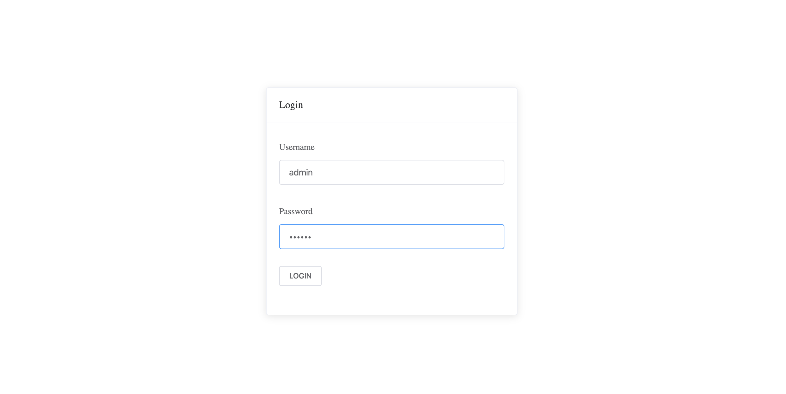
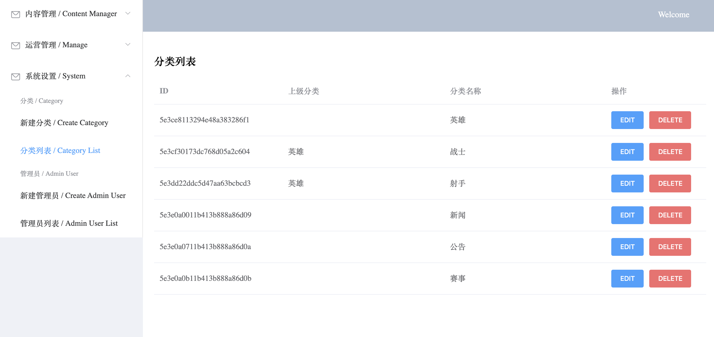
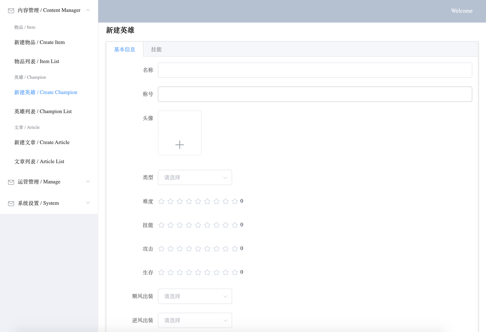
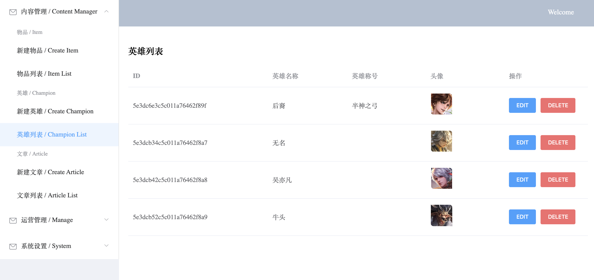
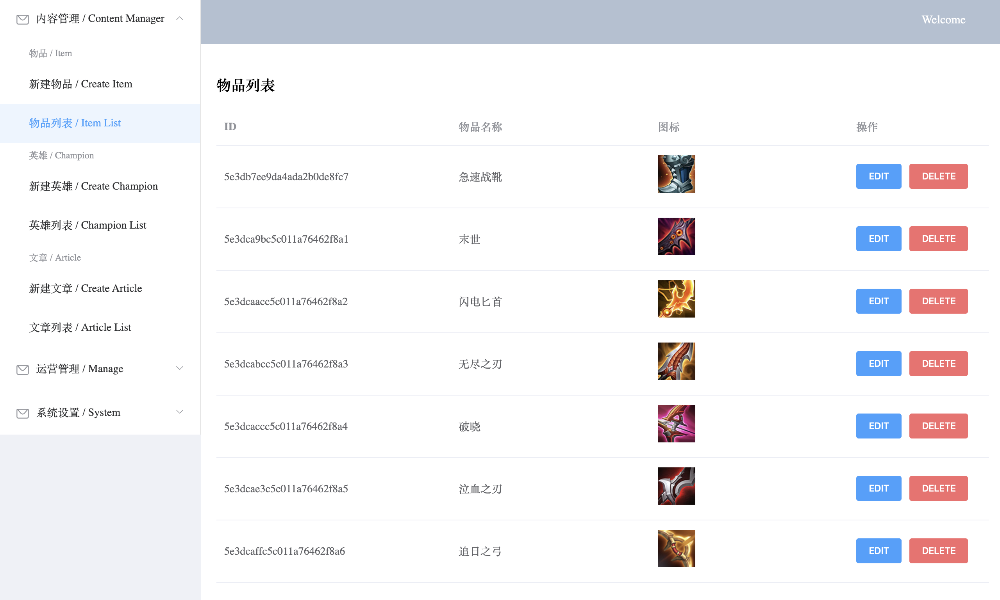

## 🏹 Vue Express Admin

> 一个基于 Vue 全家桶 + Express.js 制作 管理后台 项目

#### Preview | 预览

---

## 后台系统 | Admin System

- 基于 Element UI 的后台管理基础界面搭建

- 创建分类

- 分类列表

- 修改分类

- 删除分类

- 子分类

- 通用 CRUD 接口

- 装备管理

- 图片上传 (multer)

- 英雄管理

- 编辑英雄 (关联, 多选, el-select, multiple)

- 技能编辑

- 文章管理

- 富文本编辑器 (quill)

- 首页广告管理

- 管理员账号管理 (bcrypt)

- 登录页面

- 登录接口 (jwt,jsonwebtoken)

- 服务端登录校验

- 客户端路由限制 (beforeEach, meta)

- 上传文件的登录校验 (el-upload, headers)

## 技术栈

### Front End

- vue：^2.6.10
- vue router：^3.1.3
- axios：^0.19.1
- element-ui: ^2.4.5
- vue2-editor: "^2.10.2"

### Backend

- express: ^5.0.0-alpha.7
- http-assert: ^1.4.1
- bcrypt: ^3.0.8
- cors: ^2.8.5
- inflection: ^1.12.0
- jsonwebtoken: ^8.5.1
- mongoose: ^5.8.11
- multer: ^1.4.2

---

## 本地运行

- `git clone https://github.com/ChenxiiCheng/Vue-Express-Admin.git`

- `cd Vue-Express-Admin`

- `cd server/plugin.db.js`

- add your mongodb database address【recommend MongoDB Atlas】

- `cd admin && npm install`

- `cd server && npm install`
